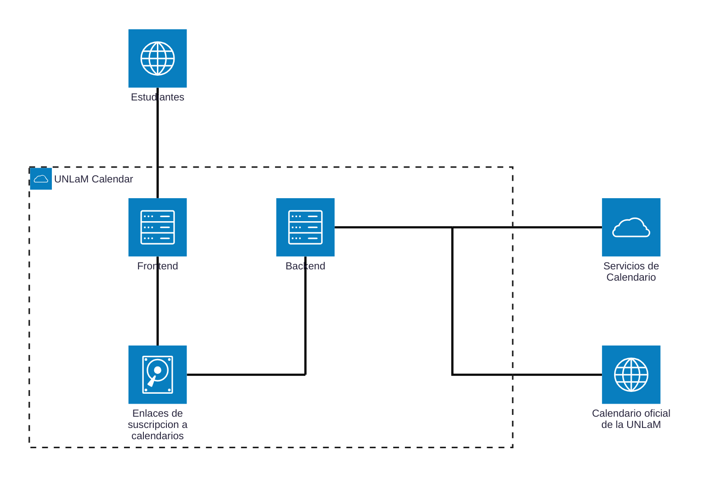
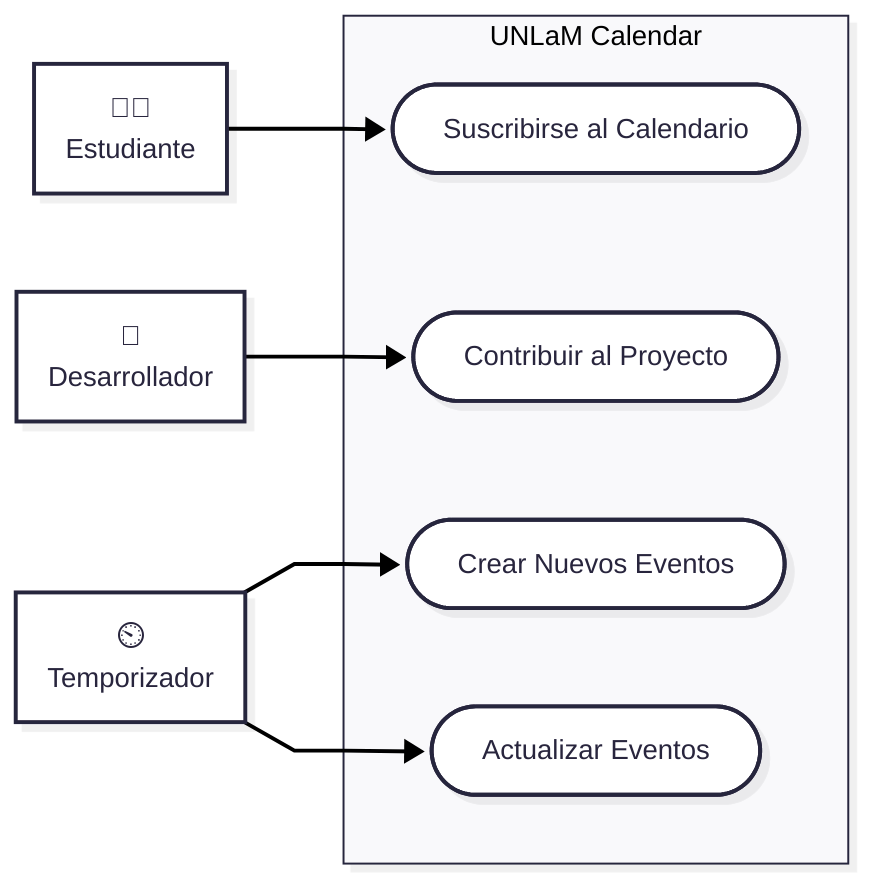

# Documento técnico

## Introducción

Se desea desarrollar una aplicación que permita a los estudiantes suscribirse a calendarios académicos utilizando el servicio de calendario que deseen, como por ejemplo [Google Calendar](https://calendar.google.com/). Dichos calendarios deberán estar basados en el [calendario oficial de la Universidad Nacional de La Matanza (UNLaM)](https://www.unlam.edu.ar/calendario-academico/) y deberán permitir a los estudiantes gestionar los eventos académicos, como agregar recordatorios, notificaciones, etc.

Actualmente, los estudiantes se ven obligados a acceder constantemente a la página del calendario oficial de la universidad para conocer las nuevas fechas y/o modificaciones de estas, lo que resulta frustrante, tedioso y poco práctico.

> A partir de ahora la aplicación será denominada como: `UNLaM Calendar`.

## Requisitos

- El código fuente deberá estar alojado en un repositorio público de [GitHub](https://github.com/) y deberá permitir contribuciones.

- El repositorio de la aplicación deberá contar con un Backend que genere los calendarios y de un Frontend que permita a los estudiantes suscribirse a estos.

- Deberá permitir a los estudiantes suscribirse a los calendarios utilizando el servicio de calendario que deseen ([Google Calendar](https://calendar.google.com/calendar), [Apple Calendar](https://www.icloud.com/calendar), etc.).

- En principio, el servicio de calendario ofrecido debe ser Google Calendar, pero la aplicación deberá estar diseñada de tal forma que permita la incorporación de otros servicios de calendario en el futuro.

- Se deberán crear calendarios por departamento (Ingeniería, Derecho, Ciencias de La Salud, etc.) con los eventos que le corresponden a cada uno.

- Se deberán crear calendarios para estudiantes con terminación de DNI par e impar a fin de mostrar los eventos que le corresponden a cada uno.

- Los calendarios, según corresponda, deberán estar basados en el [calendario oficial de la UNLaM](https://www.unlam.edu.ar/calendario-academico/), por lo que el mismo deberá ser Scrapeado diariamente.

- Si la fecha de un evento se modifica en el calendario oficial, el cambio deberá reflejarse automáticamente en los calendarios generados por la aplicación.

## Diagrama de componentes

TODO.

## Diagrama de despliegue

## Diagrama de casos de uso

> [!NOTE]
> Los casos de uso `Consultar calendario` y `Desuscribirse del calendario` son propios del servicio de calendario utilizado (Google Calendar, Apple Calendar, etc.) al momento de suscribirse, por lo tanto no son responsabilidad de UNLaM Calendar.

## Especificaciones de casos de uso

	<strong>Suscribirse al calendario</strong>

- **Descripción**: el estudiante se suscribe a un calendario utilizando el servicio de calendario que desea.
- **Actor principal**: Estudiante.
- **Actor(es) secundario(s)**: Servicio de calendario.
- **Precondición**: Crear enlaces de suscripción a calendarios.
- **Postcondición**: el estudiante logra suscribirse al calendario en el servicio de calendario que desea.
- **Flujo normal**:

  | Estudiante                                                                                                                                                                                             | Sistema                                                                                                                                                                              |
  | ------------------------------------------------------------------------------------------------------------------------------------------------------------------------------------------------------ | ------------------------------------------------------------------------------------------------------------------------------------------------------------------------------------ |
  | 1. Ingresa al Frontend de la aplicación.                                                                                                                                                               |                                                                                                                                                                                      |
  | 2. Selecciona un departamento (Ingeniería, Derecho, Ciencias de La Salud, etc.), la terminación de su DNI (par ó impar) y el servicio de calendario (Google Calendar, Apple Calendar, etc.) que desea. |                                                                                                                                                                                      |
  |                                                                                                                                                                                                        | 3. En base al departamento, la terminación del DNI y el servicio de calendario seleccionado, el sistema muestra por la interfaz del Frontend el enlace de suscripción al calendario. |
  | 4. Cliquea el enlace de suscripción al calendario.                                                                                                                                                     |                                                                                                                                                                                      |
  |                                                                                                                                                                                                        | 5. Redirige al estudiante al servicio de calendario para aceptar la suscripción al calendario.                                                                                       |
  | 6. Acepta la suscripción al calendario.                                                                                                                                                                |                                                                                                                                                                                      |
  | 7. Fin del caso de uso.                                                                                                                                                                                |                                                                                                                                                                                      |

	<strong>Contribuir al Proyecto</strong>

- **Descripción**: el desarrollador contribuye al proyecto realizando una Pull Request.
- **Actor principal**: Desarrollador.
- **Actor(es) secundario(s)**: Ninguno.
- **Precondición**: Crear repositorio del proyecto.
- **Postcondición**: el desarrollador logra contribuir al proyecto y el sistema incorpora los nuevos cambios.

> El flujo normal esta explicado en la [guía de contribución](../../CONTRIBUTING.md/#pasos-para-contribuir).

	<strong>Crear Nuevos Eventos</strong>

- **Descripción**: se scrapea el calendario oficial de la UNLaM y se crean los nuevos eventos en los calendarios.
- **Actor principal**: Timer.
- **Actor(es) secundario(s)**: Ninguno.
- **Precondición**: Crear calendarios.
- **Postcondición**: el sistema logra crear los nuevos eventos en los calendarios.
- **Flujo normal**:

  | Sistema                                                    |
  | ---------------------------------------------------------- |
  | 1. Scrapea los eventos del calendario oficial de la UNLaM. |
  | 2. Filtra los nuevos eventos.                              |
  | 3. Formatea la información de los nuevos eventos.          |
  | 4. Agrega los nuevos eventos a los calendarios.            |
  | 5. Fin del caso de uso.                                    |

	<strong>Actualizar Eventos</strong>

- **Descripción**: se scrapea el calendario oficial de la UNLaM y se actualizan las fechas de los eventos en los calendarios.
- **Actor principal**: Timer.
- **Actor(es) secundario(s)**: Ninguno.
- **Precondición**: Crear calendarios.
- **Postcondición**: el sistema logra actualizar las fechas de los eventos en los calendarios.
- **Flujo normal**:

  | Sistema                                                    |
  | ---------------------------------------------------------- |
  | 1. Scrapea el calendario oficial de la UNLaM.              |
  | 2. Filtra los eventos cuya fecha se haya actualizado.      |
  | 3. Actualiza las fechas de los eventos en los calendarios. |
  | 4. Fin del caso de uso.                                    |

