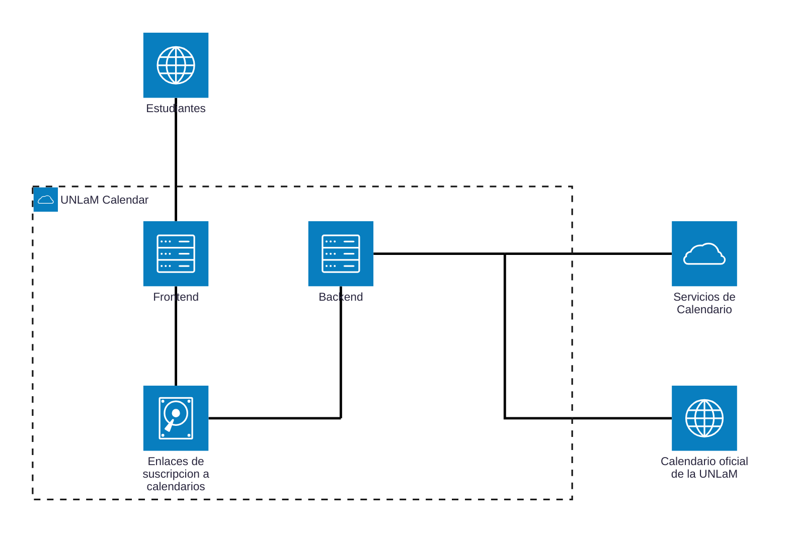

# Documento técnico

## Introducción

Se desea desarrollar una aplicación que permita a los estudiantes suscribirse a calendarios académicos utilizando el servicio de calendario que deseen, como por ejemplo [Google Calendar](https://calendar.google.com/). Dichos calendarios deberán estar basados en el [calendario oficial de la Universidad Nacional de La Matanza (UNLaM)](https://www.unlam.edu.ar/calendario-academico/) y deberán permitir a los estudiantes gestionar los eventos académicos, como agregar recordatorios, notificaciones, etc.

Actualmente, los estudiantes se ven obligados a acceder constantemente a la página del calendario oficial de la universidad para conocer las nuevas fechas y/o modificaciones de estas, lo que resulta frustrante, tedioso y poco práctico.

> A partir de ahora la aplicación será denominada como: `UNLaM Calendar`.

## Requisitos

- El código fuente deberá estar alojado en un repositorio público de [GitHub](https://github.com/) y deberá permitir contribuciones.

- El repositorio de la aplicación deberá contar con un Backend que genere los calendarios y de un Frontend que permita a los estudiantes suscribirse a estos.

- Deberá permitir a los estudiantes suscribirse a los calendarios utilizando el servicio de calendario que deseen ([Google Calendar](https://calendar.google.com/calendar), [Apple Calendar](https://www.icloud.com/calendar), etc.).

- En principio, el servicio de calendario ofrecido debe ser Google Calendar, pero la aplicación deberá estar diseñada de tal forma que permita la incorporación de otros servicios de calendario en el futuro.

- Se deberán crear calendarios por departamento (Ingeniería, Derecho, Ciencias de La Salud, etc.) con los eventos que le corresponden a cada uno.

- Se deberán crear calendarios para estudiantes con terminación de DNI par e impar a fin de mostrar los eventos que le corresponden a cada uno.

- Los calendarios, según corresponda, deberán estar basados en el [calendario oficial de la UNLaM](https://www.unlam.edu.ar/calendario-academico/), por lo que el mismo deberá ser Scrapeado diariamente.

- Si la fecha de un evento se modifica en el calendario oficial, el cambio deberá reflejarse automáticamente en los calendarios generados por la aplicación.

## Diagrama de componentes

TODO.

## Diagrama de despliegue

## Diagrama de casos de uso

TODO.
