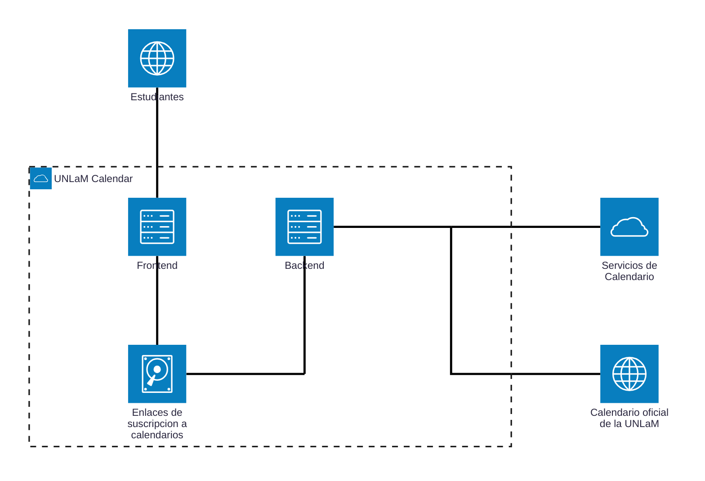
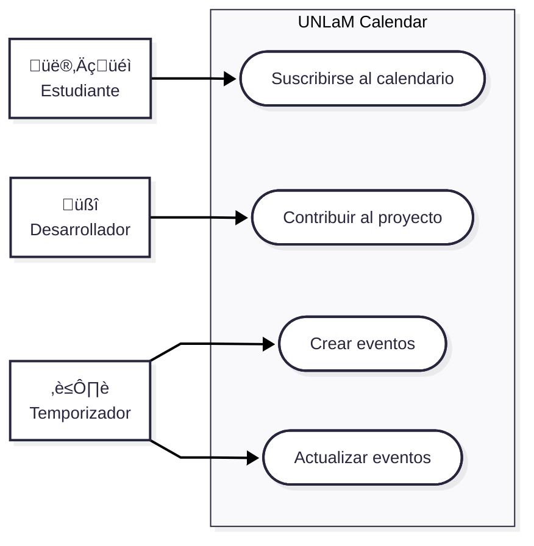

# Documento técnico

## Introducción

Se desea desarrollar una aplicación que permita a los estudiantes suscribirse a calendarios académicos utilizando el servicio de calendario que deseen, como por ejemplo [Google Calendar](https://calendar.google.com/). Dichos calendarios deberán estar basados en el [calendario oficial de la Universidad Nacional de La Matanza (UNLaM)](https://www.unlam.edu.ar/calendario-academico/) y deberán permitir a los estudiantes gestionar los eventos académicos, como agregar recordatorios, notificaciones, etc.

Actualmente, los estudiantes se ven obligados a acceder constantemente a la p√°gina del calendario oficial de la universidad para conocer las nuevas fechas y/o modificaciones de estas, lo que resulta frustrante, tedioso y poco pr√°ctico.

> A partir de ahora la aplicación será denominada como: `UNLaM Calendar`.

## Requisitos

- El código fuente deberá estar alojado en un repositorio público de [GitHub](https://github.com/) y deberá permitir contribuciones.

- El repositorio de la aplicación deberá contar con un Backend que genere los calendarios y de un Frontend que permita a los estudiantes suscribirse a estos.

- Deber√° permitir a los estudiantes suscribirse a los calendarios utilizando el servicio de calendario que deseen ([Google Calendar](https://calendar.google.com/calendar), [Apple Calendar](https://www.icloud.com/calendar), etc.).

- En principio, el servicio de calendario ofrecido debe ser Google Calendar, pero la aplicación deberá estar diseñada de tal forma que permita la incorporación de otros servicios de calendario en el futuro.

- Se deberán crear calendarios por departamento (Ingeniería, Derecho, Ciencias de La Salud, etc.) con los eventos que le corresponden a cada uno.

- Se deberán crear calendarios para estudiantes con terminación de DNI par e impar a fin de mostrar los eventos que le corresponden a cada uno.

- Los calendarios, seg√∫n corresponda, deber√°n estar basados en el [calendario oficial de la UNLaM](https://www.unlam.edu.ar/calendario-academico/), por lo que el mismo deber√° ser Scrapeado diariamente.

- Si la fecha de un evento se modifica en el calendario oficial, el cambio deberá reflejarse automáticamente en los calendarios generados por la aplicación.

## Diagrama de componentes

TODO.

## Diagrama de despliegue

```mermaid
---
config:
  look: neo
  theme: redux
---

architecture-beta
	service student(internet)[Estudiantes]

	group cloud(cloud)[UNLaM Calendar]

	service frontend(server)[Frontend] in cloud
	service disk(disk)[Enlaces de suscripcion a calendarios] in cloud
	service backend(server)[Backend] in cloud
	junction backendBJunction in cloud
	junction backendRJunction in cloud

	service calendarServices(cloud)[Servicios de Calendario]
	service officialCalendar(internet)[Calendario oficial de la UNLaM]

	student:B -- T:frontend
	frontend:B -- T:disk
	disk:R -- L:backendBJunction
	backendBJunction:T -- B:backend
	backend:R -- L:backendRJunction
	backendRJunction:R -- L:calendarServices
	backendRJunction:B -- L:officialCalendar
```

## Diagrama de casos de uso (simplificado)

```mermaid
---
config:
  look: neo
  theme: redux
  flowchart:
    curve: linear
    inheritDir: true
    htmlLabels: true
---

flowchart LR
	Student["👨‍🎓<br />Estudiante"] --> UseCase01
	Contributor["üßî<br />Desarrollador"] --> UseCase02
	Timer["⏲️<br />Temporizador"] --> UseCase03
	Timer["⏲️<br />Temporizador"] --> UseCase04

  subgraph "UNLaM Calendar"
			UseCase01([Suscribirse al calendario])
			UseCase02([Contribuir al proyecto])
			UseCase03([Crear eventos])
			UseCase04([Actualizar eventos])
  end
```

> [!NOTE]
> Los casos de uso `Consultar calendario` y `Desuscribirse del calendario` son propios del servicio de calendario utilizado (Google Calendar, Apple Calendar, etc.) al momento de suscribirse, por lo tanto no son responsabilidad de UNLaM Calendar.
