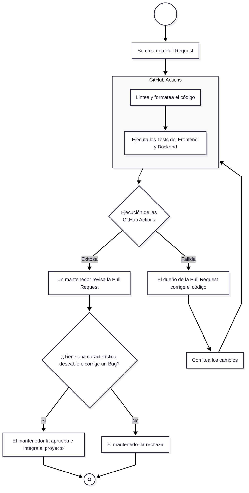

    <a href="#pasos-para-contribuir">Pasos para contribuir</a> •
    <a href="#guías-de-instalación">Guías de instalación</a> •
    <a href="#proceso-para-determinar-la-integración-de-una-pull-request">Proceso para determinar la integración de una Pull Request</a>

> Te recomendados leer la [documentación técnica del proyecto](./github/docs/) para entender su diseño y funcionamiento.

## Pasos para contribuir

1. [Crea un Fork del proyecto](https://github.com/hozlucas28/UNLaM-Calendar/fork).
2. Clona e instala el Fork del proyecto en tu máquina personal utilizando una de las [guías de instalación](#guías-de-instalación).
3. Crea una nueva Branch para realizar tu contribución (por ejemplo, `hozlucas28/feature/map-2C-events` o `hozlucas28/issue/1`).
4. Realiza tu contribución.
5. Commitea los cambios realizados.
6. Pushea la Branch que creaste a tu Fork en GitHub.
7. Crea una Pull Request en tu Fork en GitHub que apunte al repositorio original del proyecto.
8. Completa la plantilla de la Pull Request.
9. Espera la aprobación de la Pull Request por parte de los mantenedores para que tu contribución sea integrada al proyecto original.

> [!IMPORTANT]
> Te recomendamos que la nueva Branch siga la convención `<NOMBRE DE TU USUARIO>/<TIPO DE CONTRIBUCIÓN>/<BREVE TÍTULO O NÚMERO DE LA ISSUE>`, cómo se muestra en los ejemplos del paso N° 3. Ten en cuenta que `<BREVE TÍTULO>` debe ser conciso.

## Guías de instalación

### DevContainer (recomendada)

- Clona el Fork del proyecto a tu máquina personal.
- Instala [Visual Studio Code](https://code.visualstudio.com/), [Docker Desktop](https://www.docker.com/) y [Dev Containers](https://marketplace.visualstudio.com/items?itemName=ms-vscode-remote.remote-containers) (extensión de Visual Studio Code).
- Ejecuta Docker Desktop.
- Abre la carpeta del repositorio en Visual Studio Code.
- Reabre el proyecto en un DevContainer, presionando `F1` y seleccionando `Dev Containers: Rebuild and Reopen in Container`.
- Espera a que se construya e inicie el contenedor, y a que se instalen las herramientas.
- ¡Listo! El Fork del proyecto ya está instalado.

	<h3>Entorno local</h3>

- Clona el Fork del proyecto a tu máquina personal.
- Instala
  - [Visual Studio Code](https://code.visualstudio.com/)
  - [Go](https://go.dev/dl/) (v1.25.x)
  - [Node.js](https://nodejs.org/es/download) (v24.x.x)
  - [Bun](https://bun.com/docs/installation#installing-older-versions) (v1.3.3)
  - [Gitleaks](https://github.com/gitleaks/gitleaks?tab=readme-ov-file#installing) (v8.30.0)
  - [jq](https://jqlang.org/download/) (v1.x.x)
  - [yq](https://github.com/mikefarah/yq?tab=readme-ov-file#install) (v4.x.x)
  - [Zizmor](https://docs.zizmor.sh/installation/) (v1.16.3)
- Abre la carpeta del repositorio en Visual Studio Code.
- Ejecuta `bash ./scripts/setup-local-env.sh` en la terminal para terminar de configurar el entorno local.
- ¡Listo! El Fork del proyecto ya está instalado.

> Asegúrate de que Go, Node.js, Bun, Gitleaks, yq y Zizmor hayan sido añadidos al PATH. Para verificarlo ejecuta `bash ./scripts/health-check.sh --env=local` en la terminal, no debería aparecer ningún error relacionado con estas herramientas.

## Proceso para determinar la integración de una Pull Request

Al realizar una Pull Request, estos son los procedimientos automáticos y manuales que se realizan para aprobarla o rechazarla:

1. Se ejecutan automáticamente los GitHub Actions.
   - Se lintea y formatea el código.
   - Se ejecutan los Tests del Frontend y Backend.
2. Si la Pull Request ejecuta exitosamente los GitHub Actions, se comprueba si añade una característica deseable o si corrige un Bug.
3. Si se añade una característica deseable o si se corrige un Bug, un mantenedor la aprueba e integra al proyecto.

	<h3>Diagrama completo con el flujo del proceso</h3>

> [!TIP]
> Revisa el [diagrama completo con el flujo del proceso](#diagrama-completo-con-el-flujo-del-proceso) para entender mejor cómo se determina la aprobación o el rechazo de una Pull Request.
