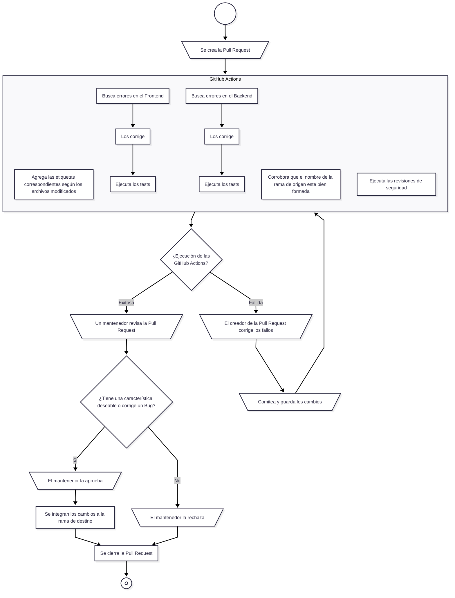

    <a href="#pasos-para-contribuir">Pasos para contribuir</a> •
    <a href="#guías-de-instalación">Guías de instalación</a> •
    <a href="#cómo-ejecutar-los-tests">Cómo ejecutar los tests</a>
		 
    <a href="#proceso-para-determinar-la-integración-de-una-pull-request">Proceso para determinar la integración de una Pull Request</a>

> Te recomendados leer la [documentación técnica del proyecto](.github/docs/README.md) para entender su diseño y funcionamiento.

## Pasos para contribuir

1. [Crea un Fork del proyecto](https://github.com/hozlucas28/UNLaM-Calendar/fork).
2. Clona e instala el Fork en tu máquina personal siguiendo una de las [guías de instalación](#guías-de-instalación).
3. Crea una nueva Branch para realizar tu contribución (por ejemplo, `hozlucas28/issue/1` o `hozlucas28/feature/map-2C-events`).
4. Realiza tu contribución.
5. Comitea los cambios realizados.
6. Pushea la Branch que creaste a tu Fork en GitHub.
7. Crea una Pull Request en tu Fork en GitHub que apunte al repositorio original del proyecto.
8. Completa la plantilla de la Pull Request.
9. Espera la aprobación de la Pull Request por parte de los mantenedores para que tu contribución sea integrada al proyecto original.

> [!IMPORTANT]
> Te recomendamos que la nueva Branch siga la convención `<NOMBRE DE TU USUARIO>/<TIPO DE CONTRIBUCIÓN>/<NÚMERO DE LA ISSUE O BREVE TÍTULO>`, cómo se muestra en los ejemplos del paso 3. Ten en cuenta que `<BREVE TÍTULO>` debe ser conciso.

## Guías de instalación

### DevContainer (recomendada)

1. Instala [Visual Studio Code](https://code.visualstudio.com/), [Docker Desktop](https://www.docker.com/) y [Dev Containers](https://marketplace.visualstudio.com/items?itemName=ms-vscode-remote.remote-containers) (extensión de Visual Studio Code).
2. Ejecuta Docker Desktop.
3. Abre la carpeta del repositorio en Visual Studio Code.
4. Reabre el proyecto en un DevContainer, presionando `F1` y seleccionando `Dev Containers: Rebuild and Reopen in Container`.
5. Espera a que se construya e inicie el contenedor, y a que se instalen las herramientas.

¡Listo! El proyecto ya está instalado.

> [!NOTE]
> Puede que al reconstruir el DevContainer ocurra un error del estilo: _"El contenedor ya existe o se encuentra en uso"_. No te preocupes, es un Bug conocido, simplemente ignóralo y vuelve a reconstruirlo.

	<h3>Entorno local</h3>

1. Instala
   - [Visual Studio Code](https://code.visualstudio.com/)
   - [Go](https://go.dev/dl/) (v1.25.x)
   - [Node.js](https://nodejs.org/es/download) (v24.x.x)
   - [Bun](https://bun.com/docs/installation#installing-older-versions) (v1.3.3)
   - [Golangci-lint](https://golangci-lint.run/docs/welcome/install/local/) (latest version)
   - [Gitleaks](https://github.com/gitleaks/gitleaks?tab=readme-ov-file#installing) (latest version)
   - [act](https://nektosact.com/installation/index.html) (latest version)
   - [GitHub CLI](https://cli.github.com/) (latest version)
   - [Docker Desktop](https://www.docker.com/) (latest version)
   - [Zizmor](https://docs.zizmor.sh/installation/) (latest version)
   - [jq](https://jqlang.org/download/) (v1.x.x)
2. Abre la carpeta del repositorio en Visual Studio Code.
3. Ejecuta `bash scripts/setup-local-env.sh` en la terminal para terminar de configurar el entorno local.

¡Listo! El Fork del proyecto ya está instalado.

> Asegúrate de que Go, Node.js, Bun, act, Gitleaks, GitHub CLI, jq, Docker Desktop y Zizmor hayan sido añadidos al PATH. Para verificarlo ejecuta `bash scripts/health-check.sh --env=local` en la terminal, no debería aparecer ningún error relacionado con estas herramientas.

## Cómo ejecutar los tests

Para ejecutar todos los tests del proyecto, puedes optar por uno de los siguientes métodos:

- Utilizar la interfaz de Visual Studio Code para ejecutar los tests del Frontend o Backend.
- Ejecutar `bash scripts/run-tests.sh`, para que se ejecuten automáticamente todos los tests del Frontend y Backend a la vez.

	<h3>Testear GitHub Actions localmente</h3>

Para testear el Workflow de una GitHub Action, o los existentes, deberás instalar [GitHub Local Actions](https://marketplace.visualstudio.com/items?itemName=SanjulaGanepola.github-local-actions) (extensión de Visual Studio Code).

> Nota: si instalas el proyecto utilizando un DevContainer, la extensión ya estará instalada.

Luego, deberás seleccionar el icono de la extensión (barra lateral izquierda de Visual Studio Code) y agregar las siguientes configuraciones:

- Secrets
  - Asigna el valor de `GITHUB_TOKEN`, presionando el icono circular al colocar el puntero encima de este, y selecciónalo.
- Payloads
  - Agrega cada uno de los Payloads que se encuentra en la carpeta [`.vscode/github-local-actions-payloads/`](.vscode/github-local-actions-payloads/).
- Options
  - Activa `no-slip-checkout` y selecciónalo.
  - Edita `actor` para que tenga como valor `hozlucas28` y selecciónalo.

> Si desea tener un mayor control sobre la ejecución de los Workflows, utilice las opciones `job` y `reuse`.

¡Listo! Ya puedes comenzar a testear localmente los Workflows de las GitHub Actions a traves de la sección `Workflows`, ubicada en el panel de la extensión.

#### Recuerda

- Seleccionar el Payload sobre el cuál quieres testear el Workflow.
- Crear los Payloads faltantes para los nuevos Workflows que quieres testear.
- Si es necesario, editar los Payloads existentes para cumplir con los requisitos de los nuevos Workflows.

> Tip: utiliza la rama `hozlucas28/github-action/workflow-test` para armar los Payloads que necesites, basándote en los ejemplos del repositorio de [Actions Toolkit](https://github.com/mcolyer/actions-toolkit-action/tree/master/fixtures).

## Proceso para determinar la integración de una Pull Request

Al realizar una Pull Request, estos son los procedimientos automáticos y manuales que se realizan para aprobarla o rechazarla:

1. Se ejecutan automáticamente los Workflows de las GitHub Actions.
2. Si la ejecución de los Workflows de las GitHub Actions es exitosa, la Pull Request es revisada por un mantenedor.
3. Si el mantenedor determina que la Pull Request añade una característica deseable o corrige un Bug, la aprueba e integra al proyecto.

	<h3>Diagrama completo con el flujo del proceso</h3>

> [!TIP]
> Revisa el diagrama completo con el flujo del proceso para entender mejor cómo se determina la aprobación o el rechazo de una Pull Request.
